## IAI-PA2-句子正负情感分类
>王子轩
>`2023011307`
>`wang-zx23@mails.tsinghua.edu.cn`
[TOC]

### 1. Model

#### 1.1 模块结构图

宏观结构在实验要求文档中已经给出,这里给出模型的具体结构.
| MLP                                                          | CNN                                                          | RNN                                                          |
| ------------------------------------------------------------ | ------------------------------------------------------------ | ------------------------------------------------------------ |
| 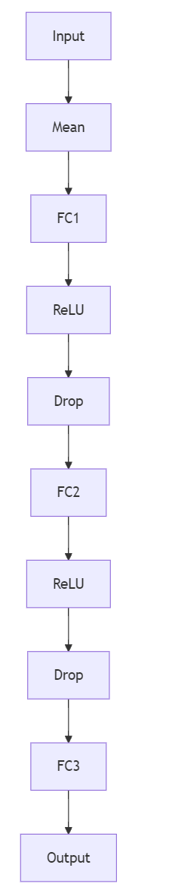 | 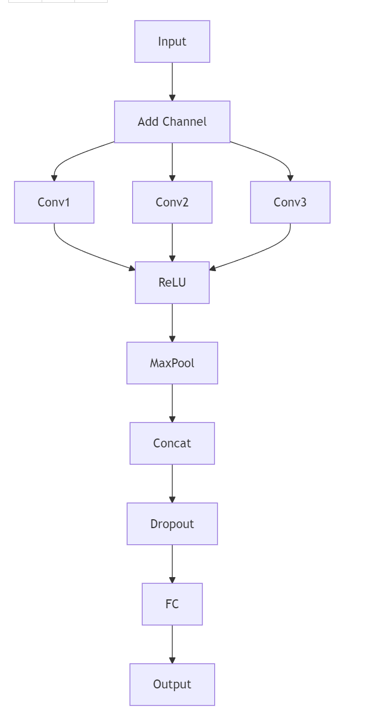 | 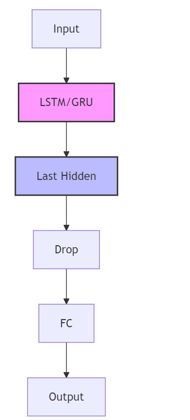** LSTM:** 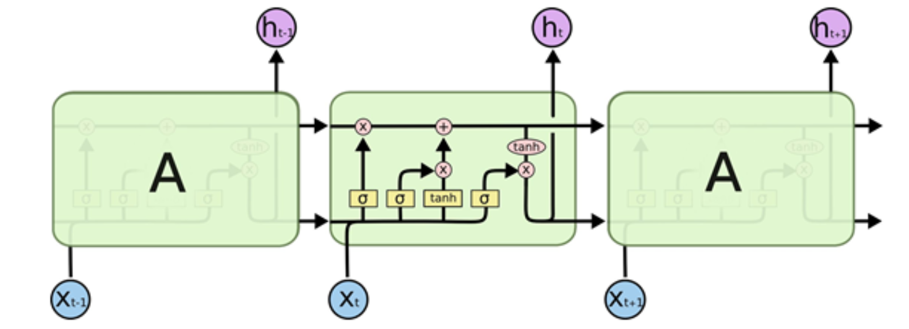 **GRU**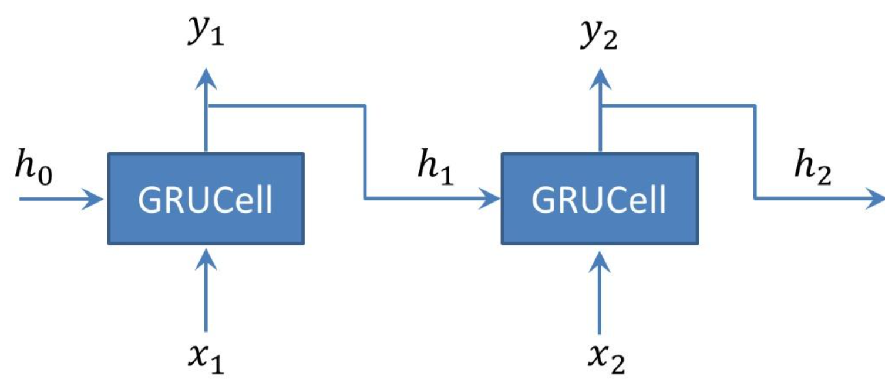 |

#### 1.2 流程分析

首先,输入文本通过Embedding层转换为词向量;接着,不同类型的模型会采用不同的结构处理这些词向量,MLP模型通过全连接层进行线性变换,CNN模型通过一维卷积核对于词向量序列进行卷积操作,RNN模型(如LSTM/GRU)则通过序列处理单元逐步处理序列中的每一个词向量;然后,经过激活函数或池化层进行非线性变换或下采样;最后,通过全连接层进行特征组合,并通过输出层得到预测结果.所有模型的最终预测结果都是通过`output.argmax(dim=1, keepdim=True)`获取的,表示预测的情感类别(0或1).

### 2. Result

#### 2.1 Test

> Performance on `Dataset/test.txt`

| Model | Accuracy (%) | F-score (%) |
|----------|--------------|--------------|
| MLP    | 77.2 | 76.0   |
| CNN   | **84.8** | **84.5** |
| LSTM     | 81.6 | 80.7 |
| GRU | 82.4 | 82.3        |

注:
训练采用的 *epoch数目: MLP=10, CNN=10, LSTM=20, GRU=20*

#### 2.2 Train-curve v.s. Validation-curve

> Curves of training and validation process

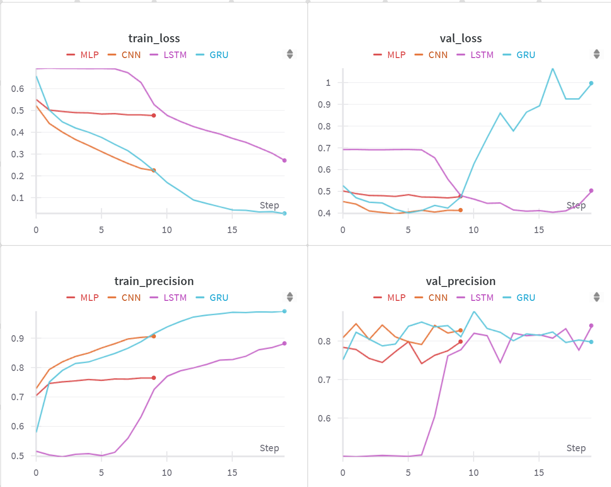

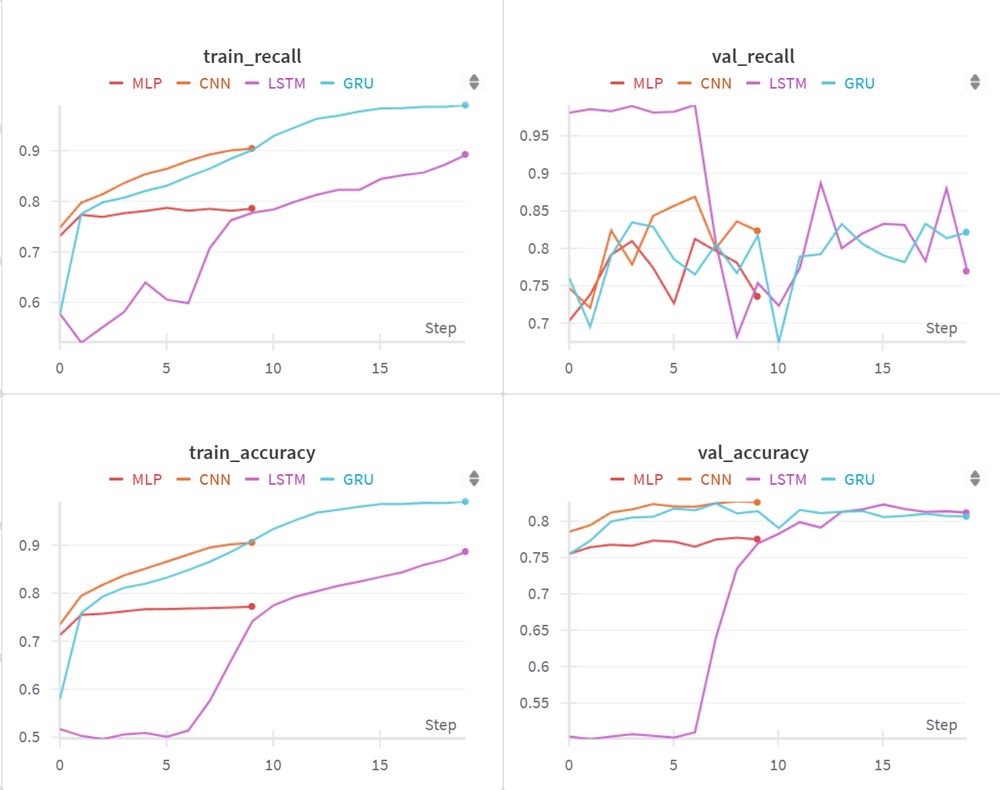

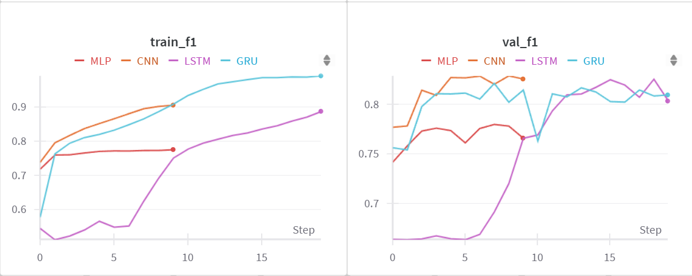

###  3 Hyper Parameters

> 实验要求中要求比较所谓的"参数"对实验结果的影响,这里理解为可以调节的超参数

- **hidden_dim (隐藏层维度)**的值决定了模型的容量和复杂度.较大的隐藏层维度可以捕捉更复杂的特征,但也会增加计算量和过拟合的风险.经过实验发现,MLP中,使用256作为隐藏层维度可以在epoch=10时候取得较好的结果,使用128或者512均带来性能下降

- **learning_rate (学习率)**的值设置为0.00,增大步长可以训练早期加速收敛,但导致训练不稳定,过低的学习率则导致收敛速度过慢.

- **num_epochs (训练轮数)**默认设置为10,在这个设置下MLP和CNN均收敛,但笔者发现RNN网络的两个模型在epoch为10时候均未能收敛.

### 4 Results Comparison

> CNN > RNN > MLP

MLP作为基线模型性能相对有限,主要原因是其简单的全连接结构无法有效捕捉文本中的序列信息和局部特征.MLP通过将输入数据通过多个全连接层进行线性变换和非线性激活,最终输出分类结果,但其在处理文本数据时表现较为平庸,**准确率和F1分数在77%左右**.相比之下,CNN(卷积神经网络)通过卷积核提取文本中的局部特征(如3-gram信息),能够更好地捕捉文本的语义信息.**CNN的卷积层和池化层有效提取了文本的局部特征,并通过全连接层进行特征组合,最终在验证集上达到了85%左右的准确率和F1分数,显著优于MLP**.RNN系列模型(如LSTM和GRU)则通过序列处理单元逐步处理文本数据,能够捕捉文本中的长距离依赖关系.LSTM通过其门控机制(输入门,遗忘门,输出门)有效解决了梯度消失问题,而GRU通过简化结构在保持性能的同时减少了计算量.**LSTM和GRU在验证集上的准确率分别达到了82%左右,表现优于MLP,但略逊于CNN**.

### 5 Problems

#### 5.1 When to stop training?

- 确定实验训练停止的最佳时机通常是为了防止模型在训练集上过拟合,从而保证其在未见过的数据上具有良好的泛化能力.观察训练过程中的验证集性能指标(如验证集损失 `val_loss` 或验证集准确率 `val_accuracy`)是判断最佳停止时机的常用方法.理想的停止点通常是**验证集损失开始持续上升或验证集准确率不再提升(甚至开始下降)**的时刻.
- **我的实现方式**:**观察训练集损失和准确率的收敛表现**+**手动设置**,设置 *epoch数目: MLP=10, CNN=10, LSTM=20, GRU=20*
  - 我的发现:CNN和MLP的过拟合现象没有RNN严重,过度训练对MLP和CNN性能损害并不明显

**固定迭代次数 vs. 验证集调整(早停法)优缺点分析:**

1.  **固定迭代次数:**
    *   **优点:**
        *   实现简单,只需设定一个固定的 `num_epochs`.
        *   训练时间固定且可预测.
    *   **缺点:**
        *   **难以确定最优次数:** 需要手动调优 `num_epochs`,不同的模型和数据集可能需要不同的迭代次数.如 
        *   **容易过拟合或欠拟合:** 如果设定的次数过多,模型容易在训练集上过拟合;如果次数过少,模型可能欠拟合,未能充分学习.

2.  **通过验证集调整(早停法):**
    *   **优点:**
        *   **自动确定停止点:** 能根据模型在验证集上的实际表现动态停止训练.
        *   **有效防止过拟合:** 在模型泛化能力开始下降时停止训练,有助于获得更好的泛化性能.
        *   **自适应性强:** 对不同的模型和数据集具有更好的适应性.
    *   **缺点:**
        *   **需要验证集:** 需要从训练数据中划分出一部分作为验证集,减少了用于训练的数据量.
        *   **训练时间不固定:** 实际训练时间取决于模型收敛速度和验证集性能变化.
        *   **需要调整超参数:** 需要设定"耐心值"(patience)早停相关的超参数.

#### 5.2 Network Parameter Initialization

##### 5.2.1 实验观察

> wandb上显示的 MLP 模型在第一个 epoch 结束后的权重和偏置的可视化分布

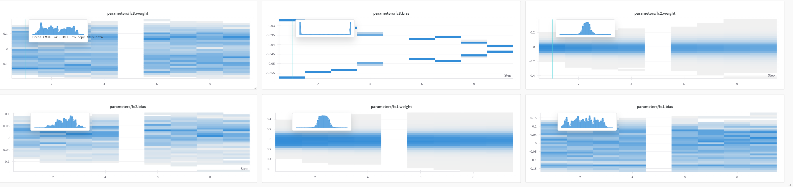

>wandb上显示的 CNN 模型在第一个 epoch 结束后的权重和偏置的可视化分布

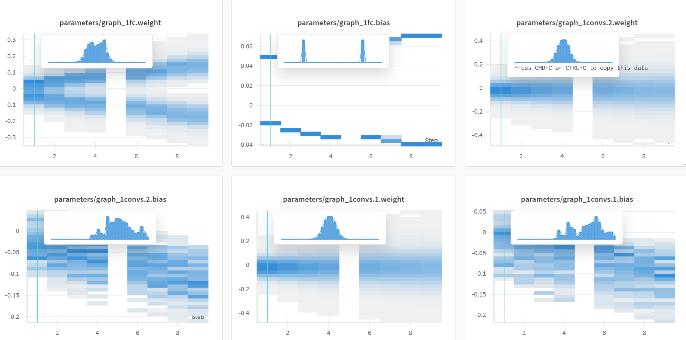                                                                                                                                          

>wandb上显示的 LSTM 模型在第一个 epoch 结束后的权重和偏置的可视化分布

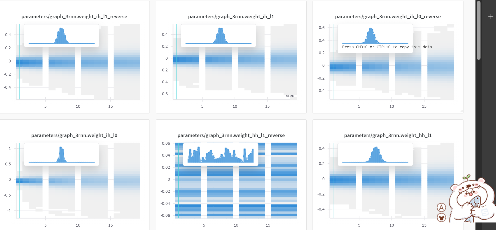

##### 5.2.2 分析结论

- 本实验中没有显式调用init方法,而是直接采用了默认初始化方法,结合观察到的实验结果,推测pytorch内部默认的weight初始化方法是默认的Kaiming初始化,适用于ReLU激活函数.

- 零均值初始化将所偏置初始化为0,实现简单,但容易导致对称性问题,使得神经元学习到相同的特征,不适合深层网络.高斯分布初始化通过引入随机性打破对称性,可通过调节均值和方差灵活控制参数分布,但参数选择较为敏感.正交初始化特别适用于RNN网络的循环权重矩阵,能有效防止梯度消失和爆炸问题,但计算复杂度较高且仅适用于方阵.Xavier初始化专门针对Sigmoid和Tanh等饱和型激活函数设计,通过保持各层输入输出方差的一致性来改善信号传播,但在使用ReLU激活函数的深层网络中效果欠佳.Kaiming初始化则专门为ReLU系列激活函数优化,考虑了ReLU的非线性特性.

#### 5.3 Overfitting

##### 5.3.1 数据层面

使用数据增强,通过对原始数据进行变换生成新的训练样本,增加训练数据的多样性,提高模型的泛化能力;在文本领域可以通过同义词替换,回译等方式实现

##### 5.3.2 模型正则化

- **L1正则化**:在损失函数中添加权重的绝对值项,促使权重变得稀疏
- **L2正则化**:在损失函数中添加权重的平方项,限制权重的大小
- **Dropout技术**:训练过程中随机"丢弃"一部分神经元,防止神经元之间的共适应,增强网络的鲁棒性

- **简化模型结构**:减少模型层数或神经元数量,选择更简单的网络架构
- **批标准化**:对每一层的输入进行标准化处理,减少内部协变量偏移,加速训练收敛

##### 5.3.3 集成学习思想

- 训练多个不同的模型并综合其预测结果
- 降低单个模型的方差,提高整体性能
- **交叉验证**:将数据集划分为多个子集进行训练和验证,更准确地评估模型性能,帮助选择最优的模型参数

##### 5.3.4 防止过度学习

- **早停(Early Stopping)**:监控验证集上的性能指标,当验证集性能开始下降时停止训练,避免模型过度拟合训练数据

#### 5.4 Model Comparison

多层感知机通过多层全连接结构实现特征的非线性变换,其结构简单且训练速度快,但由于忽略了文本的序列信息,仅通过平均池化获取句子表示,在处理复杂的文本任务时表达能力有限.卷积神经网络通过不同大小的卷积核(如3,4,5)捕捉局部语义特征,并利用最大池化操作提取最显著的特征,具有并行计算效率高,参数共享等优势,但主要关注局部特征,对长距离依赖的建模能力相对有限.循环神经网络(包括LSTM和GRU变体)则天然适合处理序列数据,通过门控机制可以有效处理长距离依赖关系,双向结构能够同时利用上下文信息,但训练速度较慢,且容易出现梯度消失或爆炸问题.在实际应用中,这些模型的选择需要根据具体任务需求和资源限制来权衡.对于简单的文本分类任务,MLP可以作为快速的基线模型;当需要捕捉局部语义特征且计算资源有限时,CNN是较好的选择;而在需要深入理解文本序列信息和长距离依赖关系的场景下,RNN及其变体则具有明显优势.从实验结果来看,CNN模型在情感分类任务中表现最佳,这**可能是因为情感分析更依赖于局部语义比如正负面情感关键词特征的提取,而CNN的多尺度卷积核和最大池化操作恰好能够有效捕捉这些特征**.此外,CNN的并行计算特性也使其在训练效率上具有优势,这对于大规模文本情感分析处理任务来说是重要的考虑因素.

### 6 心得体会

通过实现和对比MLP,CNN和RNN(LSTM/GRU)三种模型,我发现每种模型都有其独特的优势和局限性CNN模型通过使用不同大小的卷积核(3,4,5),模型能够有效捕捉文本中的局部语义特征,这恰好符合情感分析任务的特点.同时,最大池化操作帮助模型提取最显著的特征,这种设计在保留关键情感信息的同时也降低了计算复杂度.实现过程中,我也注意到了一些有趣的细节.比如,dropout的使用对防止过拟合起到了重要作用,特别是在参数较多的RNN模型中.此外,通过wandb可视化工具观察参数分布和训练过程,让我更直观地理解了模型的学习行为和优化过程.这个项目也让我体会到了深度学习中"简单有效"的原则.虽然RNN在序列处理方面有其理论优势,但在实际任务中,结构相对简单的CNN反而取得了更好的效果.这提醒我们在选择模型时,不应过分追求复杂性,而应该根据具体任务特点选择最适合的模型结构.

